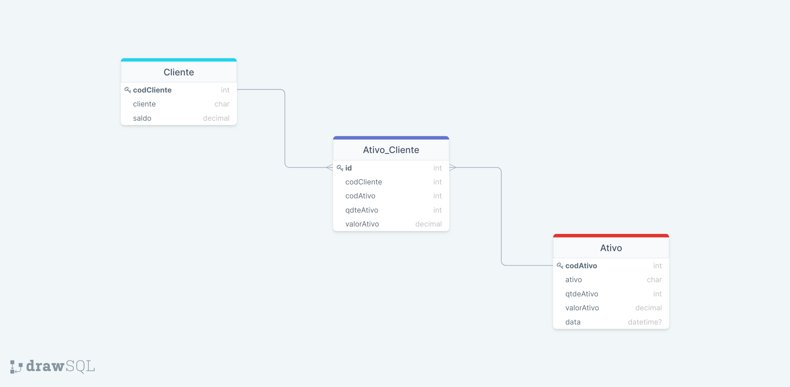

# API Carteira de ações XP

<strong>Boas-vindas ao repositório project-api-xp</strong>

Encontraremos aqui, o desenvolvimento de uma aplicação back-end, constituindo-se de uma API REST que irá compor um sistema que gerencia investimentos em ações e conta também com funcionalidades de conta digital em um único app!

## O que esta api entrega para o seu front-end ?


GET (Filtro por nome, id e/ou informações completas)
- Ações disponíveis na corretora
- Dados da Conta cliente
- Investimento do cliente

POST
- Inserção de Ativos disponíveis na corretora/db
- Inserção da Conta do cliente no db
- Inserção dos investimentos dos clientes no db  
- Depósito/Saque em conta digital

## Desenvolvimento

<details>
  <summary><strong>Arquitetura de Software</strong></summary><br />

  <strong>MSC</strong>
  
  MSC melhora a organização e divisão de responsabilidades nas aplicações organizando e distribuindo os códigos de acordo com as regras de negócio que controlam o comportamento das aplicações, divididos em camadas:

  - Camada de Modelo (M): Arquivos onde iremos executar as operações do banco de dados, como criar conexões e executar queries.
  - Camada de Serviço (S): Arquivos onde iremos estruturar nossas regras de negócio, geralmente é quem chama os métodos definidos na camada de modelo.
  - Camada de Controladores (C): Interface mais próxima da pessoa usuária ou de uma requisição, irá processar e chamar as devidas funções da camada de serviço.
  <br />
</details>

<details>

<summary><strong>Recursos e tecnologias utilizadas</strong></summary><br />

<strong>Tecnologias</strong>

`Node.js`
 Para desenvolver aplicações em Backend.

`Express` 
Um framework Node.js criado para facilitar a criação de APIs altamente funcionais no padrão de construção REST. Cria um servidor utilizando a biblioteca express, ela vai nos fornecer o que precisamos para rodar um servidor, criar rotas e utilizar nossa conexão com o banco.
  
`MySQL`
Servidor dos dados em SQL( linguagem de consulta estruturada),  linguagem para criar, pesquisar, extrair e também manipular dados dentro de um banco de dados relacional.

<strong>Bibliotecas, Frame-works e comandos de instalação</strong>

<details>
  <summary>Branch jslanguage</summary><br />

  `npm init -y`
Inicia o node Y com as perguntas padrões respondidas. Obs. Você deve ter o node instalado em seu computador.

`npm i express`
Instalar a biblioteca ‘express’.

`npm i express-async-errors` 
Suporte pra tratamento de erros em ES6.

`npm install mysql2`
Este Driver é um software que permite que você se comunique com o banco de dados a partir de uma aplicação.

`npm i nodemon -D`
Atualiza automaticamente o start da aplicação após alterações {Não se recomenda usar em ambiente de produção}, -D apenas em ambiente de desenvolvimento

`npm i dotenv`
 Lib que deixa acessível o arquivo .env via process.env, protege informações sensíveis tais como as credenciais de acesso ao banco de dados.

`npm install joi`
Biblioteca de validação, que verifica todos os atributos estão corretos do req.body, usabilidade bem abstrata e muito funcional.

`npm install eslint -D`
 Padrão eslint.

`npm install date-fns`
Biblioteca pra trabalhar com datas.

`npm i http-status-codes`
Nos permite lidar com os status HTTP de uma forma mais simples.

`npm i  - D git-commit-msg-linter`
 Para commits padronizados e com descritivos.

`npm i cors`
Mecanismo de segurança pra identificar de qual endereço ip virá as requisições, para integração com Front-End.
<br />
</details>

<details>
  <summary>Branch tslanguage</summary><br />

  `npm init -y`
Inicia o node Y com as perguntas padrões respondidas. Obs. Você deve ter o node instalado em seu computador.

`npm install -D typescript`
 Iremos usar o código compilado de TypeScript para JavaScript, por isso utilizamos como dependência de desenvolvimento, garantimos que todos usem a mesma versão.

`npm install -D @types/node`
 Pacote npm de declarações de tipos para os módulos padrões do Node.

`npx tsc –init`
Gera o arquivo tsconfig.json que possui as variáveis de configuração que definirão como o nosso código será compilado.

`npm install -D ts-node-dev`
 Executa o servidor de desenvolvimento direto no terminal, sem necessidade de compilarmos o código em JavaScript, além de reiniciar o servidor a cada alteração que fizermos, sem a necessidade de encerrarmos o processo e o iniciarmos novamente.
 
`npm i express`
Instalar a primeira biblioteca ‘express’.

`npm install -D @types/express`
Pacote npm de declarações de tipos do Express.

`npm i express-async-errors` 
Suporte pra tratamento de erros em ES6.

`npm install mysql2`
Este Driver é um software que permite que você se comunique com o banco de dados a partir de uma aplicação.

`npm install ts-node`
 Atualiza o código automaticamente.

`npm i nodemon -D`
Atualiza automaticamente o start da aplicação após alterações {Não se recomenda usar em ambiente de produção}, -D = apenas em ambiente de desenvolvimento

`npm i dotenv`
 Lib que deixa acessível o arquivo .env via process.env, protege informações sensíveis tais como as credenciais de acesso ao banco de dados.

`npm install joi`
Biblioteca de validação, que verifica todos os atributos estão corretos do req.body, usabilidade bem abstrata e muito funcional.
`npm install -D @types/joi`

`npm install eslint -D`
 Padrão eslint.
`npm install -D @types/eslint`

`npm install date-fns`
Biblioteca pra trabalhar com datas.

`npx tsc`
Start do tsconfig.

`npm i http-status-codes`
Nos permite lidar com os status HTTP de uma forma mais simples.

`npm i  - D git-commit-msg-linter`
 Para commits padronizados e com descritivos.

`npm i cors`
Mecanismo de segurança pra identificar de qual endereço ip virá as requisições, pra integração com Front-End.
`npm i --save-dev @types/cors`
Pacote npm de declarações de tipos para os módulos padrões do CORS.
<br />
</details>
<br />
</details>

## Como utilizar a API?

1. Clone o repositório

  - `git clone https://github.com/EdgardGiorge/project-api-xp.git`;

  - Entre na pasta do repositório que você acabou de clonar:
    - `cd project-api-xp`

2. Escolha a Branch que determina a linguagem de programação da api:

- Javascript: [jslanguage](https://github.com/EdgardGiorge/project-api-xp/tree/jslanguage)

- Typescript: [tslanguage](https://github.com/EdgardGiorge/project-api-xp/tree/tslanguage)

- ⚠️ A Branch tslanguage está em fase de testes, para este projeto considere usar Branch jslanguage.
    - `git checkout jslanguage`

3. Estando na branch da linguagem escolhida, Instale as dependências [**Caso existam**]

  - `npm install`
    - Se quiser contribuir com o projeto, crie uma branch e um novo Pull Request.

4. Rodar a api:

- Utilize o comando `npm start` pra rodar localmente na porta 3000 ou a de sua escolha!

<summary><strong>Explorando o Banco de dados</strong></summary><br />

1. Db MySQL para a gestão de dados:

- Na raiz do projeto existe o arquivo XP.sql que será usado para popular o banco. Você pode importá-lo localmente para testar o comportamento da aplicação:
  - Use a ferramenta MySQL Workbench para os comandos SQL(Linguagem de consulta estruturada)

  - Carregue a ferramenta com o arquivo `XP.sql`

Diagrama de entidade-relacionamento:
<br />



<br />
<details>
<summary><strong>Teste de Rotas</strong></summary><br />

1. Ferramenta:

- Para testar a aplicação, você pode fazer uma requisição usando algum client HTTP, recomendo usar uma extensão do vscode, o [Thunder Client](https://www.thunderclient.com/), faça um import do arquivo [Rotas](rotas_api-XP.json)

2. Endpoints:

GET BY ALL ASSETS
- Lista todos os ativos disponíveis na corretora: `/ativos` :
  ```json
  [
    {
      "codAtivo": 1,
      "ativo": "GGBR4",
      "qtdeAtivo": 1000,
      "valorAtivo": "23.50",
      "data": "2022-07-24T14:14:14.000Z"
    },
    {
      "codAtivo": 2,
      "ativo": "BRKM5",
      "qtdeAtivo": 20000,
      "valorAtivo": "34.65",
      "data": "2022-07-24T14:14:14.000Z"
    },          
  ]
  ```
  
GET BY ASSET CODE
 - Lista o ativo disponível na corretora pelo código `/ativos/:codAtivo`:
```json
{
  "codAtivo": 3,
  "ativo": "MGLU3",
  "qtdeAtivo": 4000,
  "valorAtivo": "2.75",
  "data": "2022-07-24T14:14:14.000Z"
}
```

GET BY ASSET NAME  
 - Lista o ativo disponível na corretora pelo nome `/ativos/name/:ativo`:
  ```json
  {
    "codAtivo": 4,
    "ativo": "BBSE3",
    "qtdeAtivo": 3000,
    "valorAtivo": "27.48",
    "data": "2022-07-24T14:14:14.000Z"
  }
  ```
  
GET BY ALL INVESTIMENTS
 - Lista a carteira de investimento dos clientes`/investimentos`:
  ```json
  {
    "codCliente": 1,
    "cliente": "Eduardo Souza",
    "codAtivo": 3,
    "ativo": "MGLU3",
    "qtdeAtivo": 30,
    "valorAtivo": "2.75"
  },
  {
    "codCliente": 2,
    "cliente": "Evelise Souza",
    "codAtivo": 3,
    "ativo": "MGLU3",
    "qtdeAtivo": 30,
    "valorAtivo": "2.75"
  }
  ```
  
GET BY INVESTIMENTS 
 - Lista a carteira do cliente pelo código`investimentos/:codCliente`:
  ```json
  {
    "codCliente": 3,
    "cliente": "Jacimara Santos",
    "codAtivo": 5,
    "ativo": "USIM5",
    "qtdeAtivo": 20,
    "valorAtivo": "8.38"
  }
  ```

GET BY ALL ACCOUNT
 - Lista Todas as contas digitais dos clientes`/conta`:
  ```json
  {
    "codCliente": 4,
    "cliente": "Dalva Eloisa",
    "saldo": "6800.00"
  },
  {
    "codCliente": 5,
    "cliente": "Meris Castanho",
    "saldo": "12000.30"
  }
  ```

GET BY ACCOUNT CODE
 - Lista a conta digital do cliente pelo código`/conta/:codCliente`:
  ```json
  {
    "codCliente": 1,
    "cliente": "Eduardo Souza",
    "saldo": "1520.80"
  }
  ```

POST ASSET REGISTRATION
  - Inserção de ativos na corretora`/ativos`:
  ```json
  {
    "ativo": "PETR4",
    "qtdeAtivo": 500,
    "valorAtivo": "8.47"
  } 
  ```

POST ACCOUNT REGISTRATION
  - Inserção de conta digital do cliente`/conta`:
  ```json
  { 
    "cliente": "Belo",
    "saldo": "12000.00"
  }  
  ```

POST INVESTIMENT REGISTRATION
  - Inserção de ações na carteira de investimentos do cliente`/investimentos`:
  ```json
  {
    "codCliente": 6,
    "codAtivo": 3,
    "qtdeAtivo": 500,
    "valorAtivo": 2.75
  }
  ```
</details>

<details>
<summary><strong>Informações finais e agradecimentos</strong></summary><br />

Oportunidades:
- Ambicioso por coisas novas, iniciei o projeto em Typescript que é a linguagem que estou aprendendo atualmente. Encontrei algumas particularidades que ainda vou desenvolver e por isso terminei o projeto em javascript. Tenho ciência que a melhoria do projeto é precisa e constante!  

Agradecimentos:
Deixo aqui meus agradecimentos à XP pela oportunidade de participar deste processo. Fazendo com que me descobrisse um verdadeiro guerreiro durante estes 10 dias de projeto, não há limites para o que podemos desenvolver e aprender.
Agradeço também aos professores da Trybe que à nove meses vem lado a lado com ensinamentos de excelência, e aos colegas e da turma XP pela parceria.

Combati o bom combate! Abraços e até o proximo commit 🤝.
</details>
<br />
<strong>Giorge</strong>
